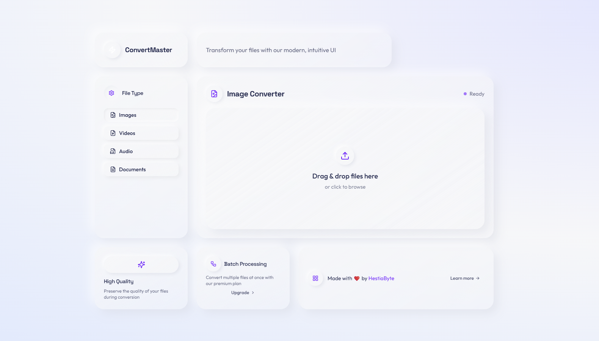

# ConvertMaster - Document Conversion

<div align="center">
  
  <p><em>Modern file conversion with a clean, intuitive interface</em></p>
</div>

A modern web application for converting documents between various formats using pure Node.js packages, designed and developed by [HestiaByte](https://hestiabyte.com).

## About

ConvertMaster is a portfolio project that demonstrates our expertise in building modern web applications with Next.js. The application focuses on providing an intuitive, user-friendly interface for file conversion tasks while ensuring clean code architecture and optimal performance.

Key technical highlights:
- Built with Next.js and TypeScript for type safety and better developer experience
- Pure client/server architecture with API routes handling conversions
- No system dependencies required - fully deployable to serverless environments like Vercel
- Modern UI with clean, accessible components

## Features

- Convert documents to various formats:
  - DOCX to HTML, TXT, MD
  - HTML to MD, PDF
  - TXT to PDF
  - MD to PDF
- Modern, intuitive UI with real-time feedback
- Responsive design that works on desktop and mobile
- Robust error handling and user guidance
- No system dependencies required - deployable to environments like Vercel

## Getting Started

1. Clone the repository
2. Install dependencies:
   ```
   npm install
   ```
   or with pnpm:
   ```
   pnpm install
   ```
3. Start the development server:
   ```
   npm run dev
   ```
   or with pnpm:
   ```
   pnpm dev
   ```
4. Open http://localhost:3000 in your browser

## API Endpoints

### Convert Document

```
POST /api/convert/document
```

Parameters (form-data):
- `file`: Document file to convert
- `targetFormat`: Format to convert to (pdf, html, txt, md)

Response:
```json
{
  "success": true,
  "conversionId": "uuid-string",
  "originalName": "document.docx",
  "targetFormat": "html",
  "downloadUrl": "/api/convert/document/download?id=uuid-string&name=document.html"
}
```

### Download Converted File

```
GET /api/convert/document/download?id=[conversionId]&name=[filename].[format]
```

Response: The converted file as a downloadable binary

## How It Works

1. File Upload: The user uploads a document file and selects the desired output format.
2. API Processing: The backend uses Node.js packages to convert the document:
   - Mammoth.js for DOCX conversions
   - Turndown for HTML to Markdown conversion
   - PDFKit for generating PDF files
3. Download: The user can download the converted file once processing is complete.

## Supported Conversions

- DOCX → HTML, TXT, MD
- HTML → MD, PDF
- TXT → PDF
- MD → PDF

## Technical Architecture

The application is built using a modern tech stack:

- **Frontend**: Next.js, React, TypeScript, Tailwind CSS
- **Backend**: Next.js API Routes
- **Document Processing**:
  - mammoth: For DOCX to HTML/TXT/MD conversion
  - turndown: For HTML to Markdown conversion
  - pdfkit: For PDF generation
- **Utilities**:
  - UUID: For generating unique conversion IDs

## About HestiaByte

[HestiaByte](https://hestiabyte.com) specializes in building modern web applications with a focus on clean design, performance, and usability. Our expertise includes:

- Web application development with React and Next.js
- API development and integration
- Custom UI/UX design and implementation
- Document processing and conversion solutions

Visit our [website](https://hestiabyte.com) to learn more about our services and portfolio.
