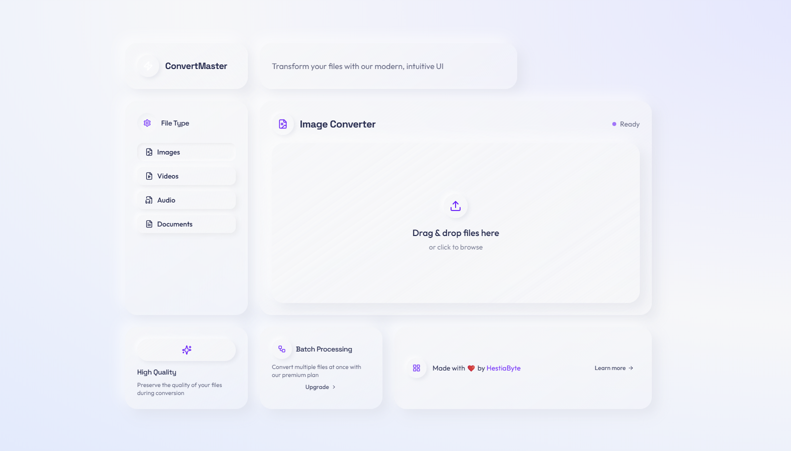

# ConvertMaster Documentation

Welcome to the ConvertMaster documentation. This directory contains detailed information about the application's architecture, implementation details, and development guidelines.

## Documentation Index

- [Main README](../README.md) - Overview, features, and general information
- [Technical Documentation](./TECHNICAL.md) - Detailed technical information for developers

## Project Links

- [HestiaByte Website](https://hestiabyte.com) - Visit our company website
- [GitHub Repository](https://github.com/hestiabyte/convertor-project) - Project source code

## Quick Start

For a quick overview of how to set up and run the project, see the [Getting Started](../README.md#getting-started) section in the main README.

## Screenshots

## Contact

For questions or feedback, please contact us through our [website](https://hestiabyte.com). 